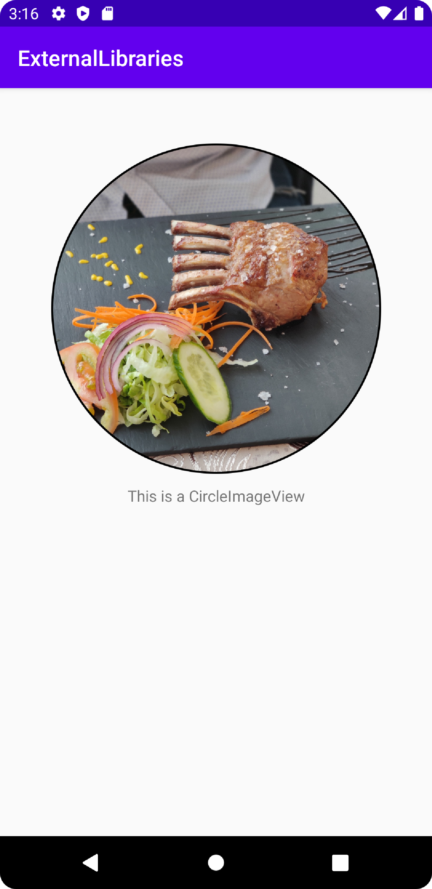

# Rapport

- [x] Find an interesting external library

An issue that has risen is to represent a ImageView within a circle,
the issue is located within the 'Project' and therefore this 'dugga' will be used as practice for a solution.

With some searching of the web, a Github repository `https://github.com/hdodenhof/CircleImageView` showed a promising solution.

- [x] Add the external library as a dependency in `app/build.gradle`

```gradle
    implementation 'de.hdodenhof:circleimageview:3.1.0'
```

This code is added under `dependencies` in `build.gradle`,
which provides access to the code in the Github repository.

- [x] Modify your XML layout and Java code to use the external library

The following code is used to create and manipulate the CircleImageView
```xml
    <de.hdodenhof.circleimageview.CircleImageView
        android:id="@+id/profile_view"
        android:src="@drawable/img_food_1"
        android:layout_width="300dp"
        android:layout_height="300dp"
        app:layout_constraintStart_toStartOf="parent"
        app:layout_constraintEnd_toEndOf="parent"
        app:layout_constraintTop_toTopOf="parent"
        android:layout_marginTop="50dp"/>
```
And
```java
CircleImageView circleImageView = findViewById(R.id.profile_view);
circleImageView.setBorderWidth(5);
```

This whole solution could be done within only the `activity_main.xml` file,
but the attribute used to create a border is manipulated in `MainActivity.java` instead.
Although unnecessary, this is done to show understanding of how to use the library in both XML and Java.

